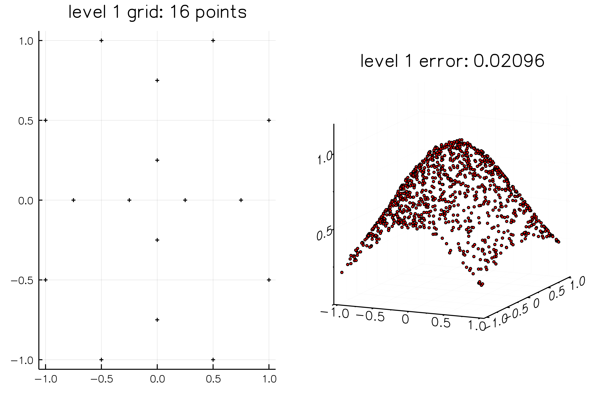
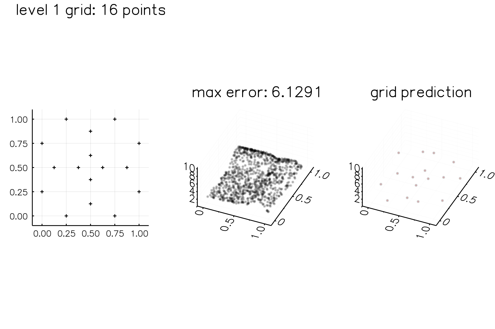

# Tasmanian.jl 

[](https://travis-ci.com/floswald/Tasmanian.jl)

[](https://ci.appveyor.com/project/floswald/tasmanian-jl)


Wrapping the awesome [tasmanian](https://github.com/ORNL/Tasmanian) library.


## Example 1: The *Darth Vader* Function

Approximating the function at increasing levels of grid refinement at 1000 randomly chosen points.


```julia
julia> using Tasmanian
julia> Tasmanian.ex2()
INFO: error on initial grid:    0.06798, with 13 points
INFO: refinement level 1 error: 0.02096, with 16 points
INFO: refinement level 2 error: 0.00896, with 36 points
INFO: refinement level 3 error: 0.00314, with 80 points
INFO: refinement level 4 error: 0.00097, with 176 points
INFO: refinement level 5 error: 0.00031, with 384 points
INFO: refinement level 6 error: 9.0e-5, with 824 points
INFO: refinement level 7 error: 2.0e-5, with 1688 points
INFO: Saved animation to /Users/74097/.julia/v0.6/Tasmanian/examples/ex2.gif
Plots.AnimatedGif("/Users/74097/.julia/v0.6/Tasmanian/examples/ex2.gif")
```



## Example 2: Genz test function

This approximates `f(x,y) = 1.0 / (abs(0.5 - x^4 - y^4) + 0.1)`.





## Checklist

- [x] Basis functionality wrapped: getters, setters
- [x] Simple tests implemented
- [x] `LocalPolynomialGrid` implemented
- [x] grid refinement implemented
- [x] Automate build of library via `BinaryBuilder`
- [ ] More tests
- [ ] Documentation
- [ ] Other grid types missing: global, sequential and wavelet


## Installation

To install julia package

```julia
Pkg.clone("git@github.com:floswald/Tasmanian.jl.git")
Pkg.build("Tasmanian")
```

The Tasmanian library will be downloaded as a precompiled binary version fitting to your system.

